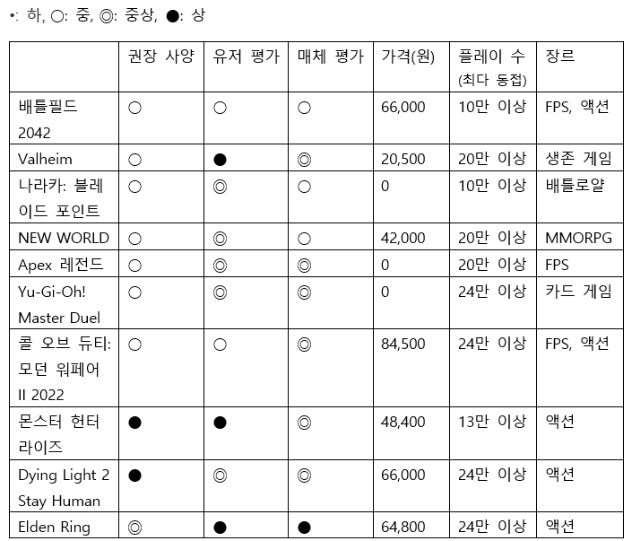

>최근 대규모 프로젝트 게임 개발이 늘어남에 따라 게임의 흥행 성패에 따른 제작사들의 부담과 게이머들의 실망 역시 늘어나고 있다. 이 글은 그러한 점들을 해결하기 위한 기준과 지표 건설을 목적으로 한다. 이를 위해 6가지 기준을 잡아 Steam 인기 게임들의 흥행 요인을 분석하여 인기 요인들을 꼽아보았다. 그리고 그중에서도 가장 큰 성공을 거둔 “Elden Ring”이 높은 점수를 받은 부분들에 주목하여 게임은 유저들에 맞춰 지나친 편의성에 초점을 맞추기보단 유저들의 목표 성취감을 고양시킬 수 있는 시스템을 만들어내는 편이 좋다는 결론을 내렸다.

## 서론

### 배경 및 목적

이 글은 2020년 이후 Steam 인기 게임들은 무엇이었고 어째서 인기가 있었는가에 대한 분석 글이다. 최근 급속도로 성장하고 있는 기술력과 그에 따른 게임 이용자들의 눈높이에 따라 전세계 게임 시장의 AAA 게임 개발이 날이 갈수록 늘어나고 있다. 그런 가운데 게임 개발비 및 타이틀의 가격 인상 또한 불가피해지면서 게임 흥행 실패에 대한 두려움과 게임 이용자들의 게임 선택에 대한 고민 역시 더더욱 깊어지는 상황이다. 이 글은 그러한 사태에 맞춰 최근 큰 성공을 거둔 대작 게임들을 분석하여 이러한 문제를 해결하기 위한 최신 게임 트렌드 분석, 소비자들의 선호도 등에 대해 알아보고자 한다.

### 분석 개요

분석 글은 우선 권장 사양, 유저 평가, 매체 평가, 가격, 플레이 수, 장르 등의 6가지 요인으로 2020~2022 인기 Steam 게임들의 인기 원인을 비교 및 분석한다.
이후 그 중에서도 특별히 두드러지는 게임, “Elden Ring” 선정하여 보다 자세히 게임의 흥행 요소에 대해 분석하고 있다.

## 본론

### I. 샘플 기준
분석에서 다룰 2020~2022 인기 게임 선정 기준은 다음과 같다.

첫째, 게임의 출시 년도가 2020년 1윌 1일~2022년 12월 31일 사이여야 한다.

둘째, Steam 사이트 기준 2021, 2022년도 판매 수익에서 최대 등급인 플래티넘을 받았어야 한다.
        
이상 두 가지 조건을 충족한 총 10개의 게임들을 선정하였다.

### II. 비교군 기준
게임들을 비교하기 위해 게임성을 평가할 총 6가지의 기준을 선정하였다. 그 기준들은 다음과 같다.

첫째, 권장 사양이다. 그래픽과 사운드에 대한 정확한 비교 지표들을 구할 수 없어 그와 관련되면서 유저들이 게임을 플레이하는데 필요한 하드웨어의 성능을 측정할 수 있는 기준인 권장 사양을 뽑아보았다. 총 4단계로 분류하였는데 그래픽 카드의 권장 사양이 GTX 970 미만이면 하, GTX 970 ~ GTX1070 미만은 중간 사양(중), GTX 1070이상부터 GTX 1080Ti 미만은 고사양(중상), 마지막으로 GTX 1080Ti 이상부터는 초고사양(상)이다.

둘째, 유저 평가이다. Steam에서 게임을 구매하고 플레이한 유저들이 남긴 평가를 기준으로 전체 평가가 복합적은 중, 대체로 긍정은 중상, 매우 긍정은 상으로 설정하였다.

셋째, 가격이다.

넷째, 플레이 수이다. 해당 게임의 최대 동시 접속 플레이어의 수를 기준으로 조사하였다.

다섯째, 매체 평가이다. Metacritic에 올라온 비평가들의 평인 METASCORE 점수를 기준으로 삼았다. 점수는 평균 50점 미만은 하, 50~74점은 중, 75점 이상~ 89점은 중상, 90점 이상은 상으로 삼았다.

여섯째, 장르이다. 게임의 장르에 따른 인기 편차가 있을지를 염두에 두고 조사하였다.

이상의 6가지 조건들을 기준으로 비교 분석을 실시한다.

이 6가지 요인이 게임성을 측정하는 최적의 측정 리스트라고 보긴 힘들 것이다. 그러나 시중에 공개된 정보로 보다 다양한 요소들을 고려해볼 필요성을 시사할 수는 있다.

### III. 비교 분석

표-1. Steam 인기 게임 각 지표에 관한 Steam 차트 인용[1]

->	권장 사양은 낮은 편이 좋으며, 유저 평과 Metacritic 평이 높은 액션류가 잘 팔린다.

표를 보면 권장 사양의 대다수가 중을 기록하며 주로 높지 않은 권장 사양의 게임들이 인기 게임의 다수를 차지했음을 알 수 있다. 이것은 높은 수준의 사양을 필요로 하는, 높은 품질의 그래픽과 사운드를 제공하는 게임보다는 유저들 대다수의 하드웨어 환경에 맞게 제작한 맞춤형 게임들이 강세라는 점을 보여준다. 또한 유저 평가와 매체 평가에서는 두 부문 모두 중간 수준의 평가를 받은 “배틀필드 2042”등의 예외가 있지만 대체로 중상 이상의 평을 받은 작품들이 다수를 차지했음을 알 수 있다. 가격에서는 10가지 샘플 모두 다양한 가격대에 위치하였다. 즉, 유저들은 자신들이 마음에 들어 하는 게임이 있을 경우 금액에 크게 신경을 쓰지 않음을 알 수 있다. 최다 동시 접속자 수에서는 모든 게임이 다 10만 이상의 상위 스코어를 기록하면서 판매 수익과 정비례하는 양상을 보였다. 마지막으로 장르에서는 단연 액션 장르가 인기가 많음이 드러났다. 표에서는 FPS, MMORPG 등 세세한 기준으로 나눠 놨지만 큰 틀에서는 모두 전투, 폭파, 추격 등을 메인 컨텐츠로 하는 액션 장르에 들어간다.

### IIII. 두드러진 Elden Ring의 흥행

표-2. Elden Ring 등 인기 게임들의 Statistics를 HowToBeat에서 인용[2]

표본들 중 가장 눈에 띄는 흥행을 거둔 작품은 단연 “Elden Ring”이었다. Main Story가 존재하는 게임들을 뽑아 위의 부문들을 조사해보았다. “HowLongToBeat” 사이트에서 자체 집계한 기록들이기에 정확하다고 볼 순 없으나 어느 정도의 경향성은 파악할 수 있다.

위의 표에서 GOTY란 세계에서 가장 공신력 있는 게임 시상식에서의 수상을 의미한다. 그런 면에서 Most played, Most Reviews에서 1위, GOTY 수상까지 한 “Elden Ring”은 2020~2022에 출시한 작품들 중 가장 큰 흥행과 비평을 잡은 작품이라고 하여도 될 것이다. 그렇다면 이러한 “Elden Ring”의 성공의 이유는 무엇인가?

 위의 표를 보면 “Elden Ring”은 Most completed, Most Rated, Longest games 부문에서도 모두 가장 높은 순위를 차지하고 있다. Most Rated와 Longest games의 높은 지수는 Elden Ring의 게임 난이도가 상대적으로 어렵다는 반증이다. 반면에 Most completed는 그러한 난이도에도 불구하고 유저들이 끝까지 게임을 complete할 수 있는 재미와 몰입감을 준다는 것을 알 수 있다.
 어려운 난이도와 높은 실패율에도 “Elden Ring”이 가장 대중적인 히트를 친 이유는 무엇일까. 한국 컨텐츠 진흥원에서 발행한 2023년 1,2월호 <글로벌_게임산업_트렌드>[3] 글에 따르면 현대 게임의 친절성과 편리성이 높아지면서 게임 이용자들이 오히려 게임 내에서 새로운 컨텐츠를 발견하고 재미를 느낄 수 있는 부분들이 배제되고 있는 성향 때문이라고 한다.
 “Elden Ring”은 과거 Dark Soul 시리즈를 발매하며 소울류라는 높은 게임 난이도를 특징으로 삼아 게이머들 사이에서 소문을 탔다. 그러한 특성에서 “Elden Ring”은 오픈 월드라는 모험적 컨텐츠를 도입하여 유저들이 자신만의 공략 방법과 모험 내용 등 미지의 컨텐츠들을 생성하고 즐길 수 있게 해주었던 것이다. 그러한 점이 “Elden Ring”의 이러한 대히트의 원인이 아닐까 생각해본다.

요지는 게임을 클리어하는 것이 목표가 아니라 실패와 새로움을 통한 즐거움을 강조하는 작품으로써 이러한 작품을 통해 게이머들이 게임을 하는 근본 이유에 대해 다시 생각해 볼 수 있다고 생각한다.

## 결론
범람하는 게임 컨텐츠에서 게임 이용자들이 좋은 작품들을 골라내기 위해선 Metacritic과 실질 유저 평론들을 참고하는 편이 도움이 된다. 하지만 유저 평론과 비평가의 평론이 일치하는 케이스는 10개의 표본 중 딱 절반인 5개에 불과했다. 따라서 여러 평들을 참고하되 본인에게 적합한지 해당 평들을 꼼꼼히 읽어보고 판단하는 것이 바람직할 것이다. 반대로 게임 제작사들이 인기 작품을 만들어내기 위해선 게임 판매 가격에 초점을 맞추기 보다는 유저들의 하드웨어 상황에 맞추는 최적화 작업에 신경을 써야 하는 편이 좋다. 또한 “Elden Ring”의 성공으로 보아 게임 자체를 지나치게 유저들의 편이에 맞추는 것 보다는 유저들이 실패해도 좋으니 게이머들의 성취 동기를 자극할 수 있는 부분에 대해 고민해보는 것이 좋다고 생각한다.
	
그러나 이 분석은 Steam의 플래티넘 단계를 받은 단 10가지의 표본들 만을 대상으로 하였으며 조사한 지표들은 전체 집계가 아닌 “HowLongToBeat” 사이트의 자체 집계 표본들을 보며 분석하였으므로 이러한 주장들에 객관적인 정확도를 제공하진 않을 수 있음을 밝히며 글을 마무리한다.

## 참고문헌 및 출처:
[1] Steam 차트 개요, https://store.steampowered.com/charts/

[2] HowLongToBeat Stats 2020~2022, https://store.steampowered.com/charts/

[3] 한국콘텐츠진흥원, 글로벌 게임산업 트렌드 2023년 1~2월호, https://www.kocca.kr/global/2023_1+2/download/%EA%B8%80%EB%A1%9C%EB%B2%8C%20%EA%B2%8C%EC%9E%84%EC%82%B0%EC%97%85%20%ED%8A%B8%EB%A0%8C%EB%93%9C(2023%EB%85%84%201+2%EC%9B%94%ED%98%B8).pdf
